<p align="center">
  
</p>

<h1 align="center">VOZEB</h1>

<p align="center">
  <a href="https://github.com/csyqlz/vozeb"></a>
  <a href="VERSION"></a>
  <a href="LICENSE"></a>
  <a href="https://vercel.com/"></a>
  <a href="https://nextjs.org/"></a>
</p>

<p align="center">
  演示站：<a href="https://www.vozeb.com">www.vozeb.com</a>
</p>

VOZEB 是一款面向 AI 图片创作、素材管理和视觉方案迭代的开源工作台。它把无限画布、AI 生成、参考图编辑、提示词库、素材沉淀、用户权限、管理员配置和本地 Agent 能力放到同一个工作流里，适合个人创作者、本地部署场景和小团队内部使用。

VOZEB 当前版本为 `v0.8.9`，这是基于原创开源画布项目继续开发的二开版本。感谢原创作者 basketikun 对无限画布、AI 创作工作流、Canvas Agent 和 Codex 插件能力的开源贡献。

版本更新记录请查看 [GitHub Releases](https://github.com/csyqlz/vozeb/releases)。

## 最新更新

`v0.8.9` 修复服务器部署后默认渠道生成任务可能统一显示 `fetch failed` 的问题，后台任务会优先通过 `VOZEB_INTERNAL_ORIGIN` 或本机 `127.0.0.1:3000` 访问站内代理。

`v0.8.9` 修复站内内部回调与 Node dispatcher 不兼容导致的误报连接失败，API Key 正确时不会再因为这层回调异常直接失败。

`v0.8.9` 优化默认渠道连接失败提示，生成失败时会提示检查后台 Base URL、服务器网络、DNS、HTTPS 证书或代理配置，不向前端暴露接口密钥。

`v0.8.8` 优化管理员密码重置脚本，重置前仍会自动备份 `.data/auth.json`，但只保留最近 3 份密码重置备份，避免多次修改后长期占用服务器空间。

`v0.8.8` 修复后台新增用户接口的未登录、无权限和失败提示文案，避免管理员操作时出现乱码或英文兜底提示。

`v0.8.7` 保留页面预加载体验，同时将配置弹窗、提示词库、素材库和版本更新弹窗改为空闲预热，减少首页与工作台首屏包体压力。

`v0.8.7` 优化首页 Footer，桌面端保持一行横排，手机端改为品牌与社交入口同排、版权独立展示、条款与友情链接左右分组，并默认加入标题 `VOZEB`、地址 `www.vozeb.com` 的友情链接。

`v0.8.7` 修复生图/视频工作台生成中占位仍显示选择框的问题，并将浅色模式结果选择框优化为白底黑勾。

`v0.8.7` 新增终端重置管理员密码脚本，管理员忘记密码时可在本地或 Docker 容器中按用户名、邮箱或用户 ID 重置指定管理员账号，执行前会自动备份 `.data/auth.json`。

`v0.8.6` 统一文档站点 logo 与 favicon 为 VOZEB 标志，并修复 `pnpm run format:check` 历史格式检查失败；不改变数据库结构。

> [!CAUTION]
> 项目仍处于快速开发阶段，不保证历史数据兼容。当前更适合个人或本地部署，不建议直接公网多人共用。

## 功能总览

- 无限画布：多画布项目、节点拖拽缩放、连线、小地图、撤销重做、导入导出。
- AI 图片创作：支持文生图、图生图、参考图编辑、图片反推提示词、图片切图、局部蒙版修改和图片放大；图片工作台支持按生成记录保留结果、同记录追加生成、失败重试、任务轮询续取、结果勾选删除、丢失图片清理、记录标题重命名、图片恢复 fallback 和每用户并发生成上限。
- 音频与视频：支持音频节点、视频生成、声音/水印配置，以及图片、视频、音频参考输入；视频工作台支持按用户并发上限同时生成多条记录并保留轮询状态。
- 画布助手：围绕选中节点和上游节点对话、生图，并把结果插回当前画布。
- 提示词库：支持公共提示词库、我的提示词、标签、分类、封面和提示词素材沉淀；管理员公共提示词会采集原作者接入的远程提示词源，并只保留可访问的远程图片 URL。后台公共提示词管理支持分页搜索、多选和批量删除，手机端会使用卡片布局避免表格溢出。
- 素材管理：支持图片、文本、视频等素材保存、复用、导入导出和 WebDAV 同步。
- 用户系统：支持账号密码注册登录、邮箱注册开关、SMTP 邮箱服务配置、管理员后台、用户角色、账号状态、积分余额和签到奖励。
- 管理后台：支持用户、网站、系统接口、提示词库、数据备份导入和生成日志管理；生成日志可查看所有用户的图片/视频记录、提示词、入口来源、模型、状态、耗时和结果访问地址，并支持搜索、日期筛选、全选与删除。
- 通用接口：管理员可配置 OpenAI 兼容接口、系统模型渠道、默认模型、每用户图片/视频并发上限，并允许或禁止用户自配接口。
- 本地 Agent：通过本机 Canvas Agent 连接 Codex / Claude Code，让 Agent 通过 MCP 操作当前画布。
- Codex App 插件：提供 Codex app 插件，安装后可自动注册 MCP 并尝试拉起本地 Agent。
- 版本更新：管理员右上角版本入口可查看更新记录，并从 `csyqlz/vozeb` 检查最新版本；普通用户端隐藏 GitHub 和版本入口。

## 使用教程

### 1. 低配服务器部署

0.5G 到 2G 内存服务器建议使用发布镜像，不在服务器现场构建源码：

```bash
git clone https://github.com/csyqlz/vozeb.git
cd vozeb
docker compose pull
docker compose up -d
```

默认 `docker-compose.yml` 使用 `ghcr.io/csyqlz/vozeb:latest`，只会拉取预构建镜像并启动容器，不会执行 `next build`。账号、后台设置、签到记录和公共提示词会保存在 `vozeb-data` 数据卷里。

### 2. 首次初始化

打开 `http://服务器IP:3000`，第一次注册的账号会自动成为管理员。这个首个管理员账号用于初始化站点，管理员登录后可进入 `管理员后台`，配置网站标题、Logo、SEO、注册策略、邮箱服务、模型渠道、默认模型、用户积分和公共提示词库。

### 3. 配置默认模型渠道

进入 `管理员后台 -> 系统设置 -> 模型渠道`，填写你的 OpenAI 兼容接口或 Gemini 接口 `Base URL`、`API Key`、模型名称，并启用默认渠道。默认渠道由服务端代理请求，用户前端不会看到管理员保存的 API Key。

如果部署后生图、视频或画布生成全部提示 `fetch failed`，通常是服务器无法访问模型接口，或容器/反向代理无法从服务端回调自己的公网域名。请按下面顺序检查：

```bash
# 1. 容器内确认 VOZEB 可以回调自己的站内代理
docker compose exec app sh -lc 'echo $VOZEB_INTERNAL_ORIGIN'

# 2. 默认值建议保持为容器内部地址
VOZEB_INTERNAL_ORIGIN=http://127.0.0.1:3000

# 3. 如果模型接口需要代理，给容器补充代理变量
HTTPS_PROXY=http://127.0.0.1:7890
HTTP_PROXY=http://127.0.0.1:7890
ALL_PROXY=http://127.0.0.1:7890
```

`docker-compose.yml` 和低内存 compose 已默认写入 `VOZEB_INTERNAL_ORIGIN=http://127.0.0.1:3000`。如果你的服务不是 3000 端口，请改成实际内部端口。Base URL 请填写模型服务商提供的地址，例如 `https://api.example.com/v1`；不要填写 VOZEB 自己的访问地址。

### 4. 配置邮箱注册

进入 `管理员后台 -> 系统设置 -> 账号策略` 打开“邮箱注册”。再进入同页的“邮箱服务”填写 SMTP：

```text
QQ 邮箱：smtp.qq.com / 465 / SSL 开启
网易邮箱：填写网易提供的 SMTP、端口和授权码
企业邮箱：填写服务商提供的 SMTP、端口、SSL 和授权码
```

保存前可以点击“测试邮箱”。测试成功后，普通用户注册必须获取 6 位邮箱验证码；未验证邮箱不能直接创建账号。忘记密码和修改绑定邮箱也会复用这套 SMTP。

### 5. 用户与账号管理

普通用户和管理员都可以从右上角账号菜单进入 `个人资料`，修改昵称、绑定邮箱和登录密码。管理员可在后台 `用户管理` 中修改用户昵称、邮箱、角色、状态、积分余额，必要时重置用户密码或删除用户。系统会阻止删除当前管理员和最后一个管理员，避免后台被锁死。

### 6. 管理员忘记密码

如果管理员还能登录后台，建议直接在 `管理员后台 -> 用户管理` 里重置密码。如果所有管理员都忘记密码，可以在服务器终端使用离线脚本修改 `.data/auth.json` 中指定管理员的密码哈希。脚本必须明确指定 `--username`、`--email` 或 `--id`，不会自动选择账号；写入前会先备份当前账号数据库到 `.data/restore-backups`，密码重置备份只保留最近 3 份，避免长期占用空间；脚本不会删除用户、提示词、生成日志或素材。

本地源码部署时，在 `web` 目录执行：

```bash
cd web
pnpm run reset:admin-password -- --username admin --password "NewPass123!"
```

Docker Compose 部署时，在项目根目录执行：

```bash
docker compose exec app node /app/web/scripts/reset-admin-password.mjs --username admin --password "NewPass123!"
docker compose restart app
```

如果忘记管理员用户名，可以先列出管理员账号：

```bash
cd web
pnpm run reset:admin-password -- --list-admins
docker compose exec app node /app/web/scripts/reset-admin-password.mjs --list-admins
```

如果使用了自定义数据目录，手动指定数据目录即可：

```bash
cd web
pnpm run reset:admin-password -- --data-dir "/path/to/.data" --username admin --password "NewPass123!"
```

命令完成后，用新密码重新登录。旧登录会话会被清理，已经登录的该管理员需要重新登录。

### 7. 首页 Footer 和社交媒体

进入 `管理员后台 -> 网站设置 -> 首页收尾与社交媒体`，可以配置首页底部内容：

```text
版权所有：显示在首页 Footer 左侧
使用条款链接：默认 /terms，也可以填写外部 URL
隐私政策链接：默认 /privacy，也可以填写外部 URL
邮箱联系：默认开启，支持 mailto: 邮箱链接
Telegram：默认开启，可填写频道或联系人链接
X：默认开启，可填写 X 主页链接
Instagram：默认开启，可填写 Instagram 主页链接
```

每个社交媒体都有单独的显示开关。关闭后首页 Footer 不会显示该入口。

### 8. 更新版本

低配服务器更新只需要拉取新镜像并重启：

```bash
docker compose pull
docker compose up -d
```

不要执行 `docker compose down -v`，否则会删除 `vozeb-data` 数据卷。容器默认使用 `VOZEB_DATA_DIR=/app/web/.data`，本地 standalone 预览也会自动把数据库放回 `web/.data`，不会写进 `.next/standalone` 构建产物。升级前也可以在管理员后台概览点击“备份用户数据库”，下载 `.data/auth.json`、`.data/prompts.json` 和 `.data/generation-logs.json` 留底；需要迁移回新服务器时可用“导入数据库”恢复备份，导入前会自动把当前数据快照保存到 `.data/restore-backups`。生成日志预览资源保存在 `.data/generation-assets`，随数据卷保留。

## 详细功能

### 画布创作

VOZEB 的核心工作流围绕无限画布展开。你可以在画布里放置图片、文本、音频、视频和配置节点，通过连线组织上下游关系，用节点工具条进行复制、下载、保存素材、编辑、切图、放大、蒙版局部修改等操作。画布支持多项目管理、导入导出、撤销重做、小地图和快捷键。

### AI 生成

项目支持 OpenAI 兼容接口，浏览器前台可直接请求用户配置的 `Base URL` 和 `API Key`。支持文本问答、文生图、图生图、参考图编辑、音频生成和视频生成。生图/视频工作台的手机端记录面板会使用底部抽屉滚动展示，生成中的状态不会挤乱记录统计。视频生成支持 Seedance 2.0 场景，可通过火山方舟 Agent Plan 接入。

### 提示词与素材

公共提示词由管理员后台维护，会出现在用户端提示词库。后台公共提示词管理支持新增、远程封面 URL、分页搜索、多选和批量删除，切换到提示词库时只加载当前页，适合维护大型提示词库。用户也可以维护自己的提示词，把稳定的提示词、参考风格和生成结果沉淀为素材。素材库支持本地保存、导入导出和可选 WebDAV 同步，默认远程目录为 `vozeb`，适合长期积累个人创作资产。

### 用户与管理员

VOZEB 增加了账号系统和后台管理能力。站点首次注册的账号会自动成为管理员，用于完成初始化配置。管理员可以控制注册是否开放、是否要求邮箱注册，调整用户角色、账号状态、积分余额、签到奖励、系统接口渠道和默认模型。后台采用侧边栏切换布局，概览、系统设置、用户管理、生成日志和公共提示词库分区更清楚，并继续适配手机端管理场景。

管理员还可以在后台“网站设置”中维护前台网站标题、Logo URL、SEO 标题、SEO 描述和关键词。保存后首页、顶部导航、浏览器标题、Open Graph 和 favicon 会同步读取新的站点信息。

### 邮箱注册与 SMTP

进入 `管理员后台 -> 系统设置 -> 账号策略`，打开“邮箱注册”后，普通注册页会要求填写邮箱并获取 6 位验证码；验证码通过后才允许创建账号并登录，邮箱也会校验不能重复。

进入 `管理员后台 -> 系统设置 -> 邮箱服务` 可以配置发信服务。QQ 邮箱默认配置为：

```text
邮箱类型：QQ 邮箱
SMTP 服务器：smtp.qq.com
端口：465
SSL：开启
邮箱账号：你的 QQ 邮箱
授权码 / 密码：QQ 邮箱 SMTP 授权码
发件邮箱：可留空，默认使用邮箱账号
发件名称：VOZEB
```

网易邮箱、企业邮箱或其他邮箱服务，把 SMTP 服务器、端口、SSL、邮箱账号和授权码改成服务商提供的参数即可。配置完成后可以点击“测试邮箱”，默认发送到发件邮箱，也可以单独填写测试收件邮箱。忘记密码、注册验证码和修改邮箱验证码都会复用这里的 SMTP 配置。

### Agent 与插件

本地 Canvas Agent 可以连接 Codex / Claude Code，让 Agent 通过 MCP 读取和操作当前画布。仓库同时提供 Codex App 插件，安装后会注册 `vozeb-canvas` MCP，并尝试拉起本地 Agent。部分内部存储 key 仍保留旧名称，以避免破坏已有用户数据和插件兼容性。

## 效果展示

<table width="100%">
  <tr>
    <td width="50%">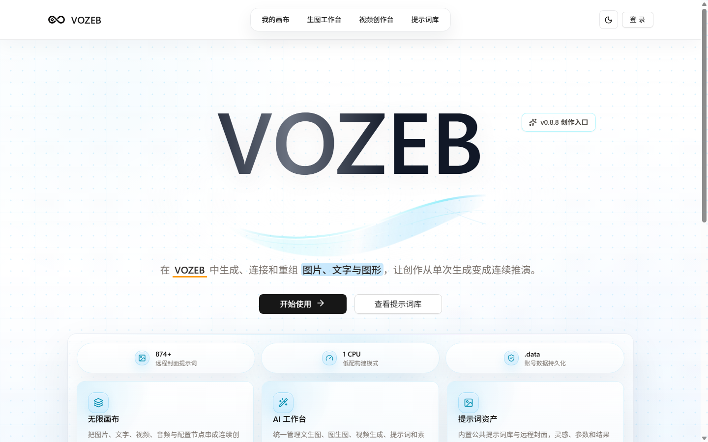</td>
    <td width="50%">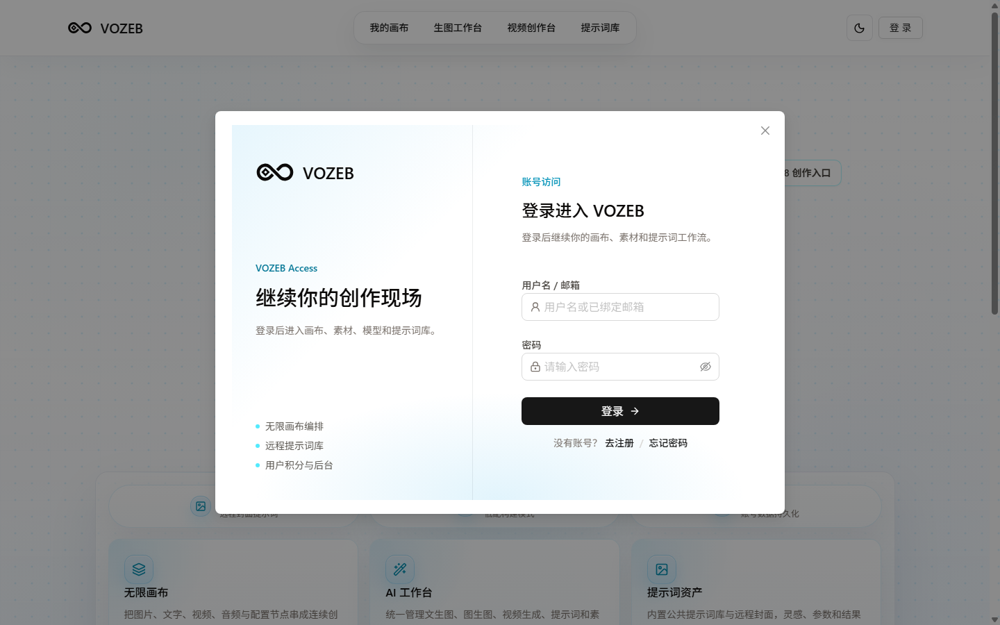</td>
  </tr>
  <tr>
    <td width="50%">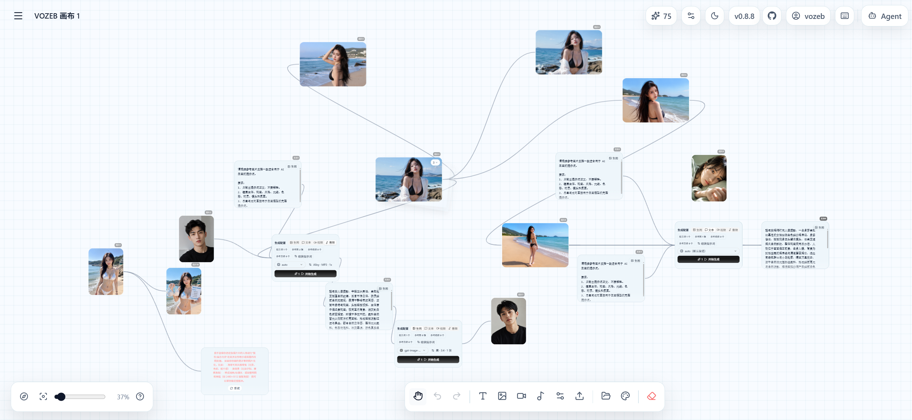</td>
    <td width="50%">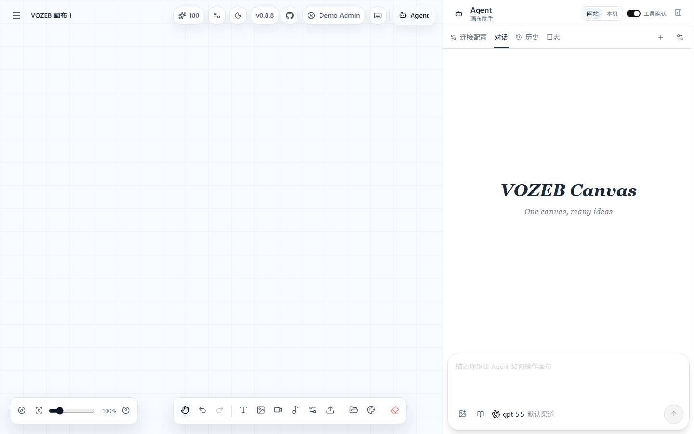</td>
  </tr>
  <tr>
    <td width="50%">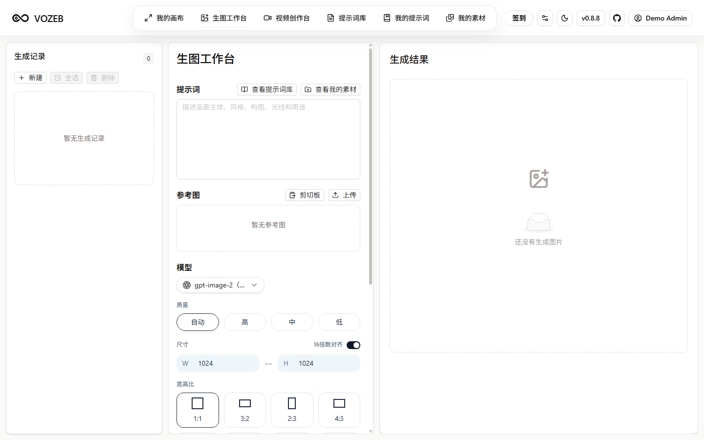</td>
    <td width="50%">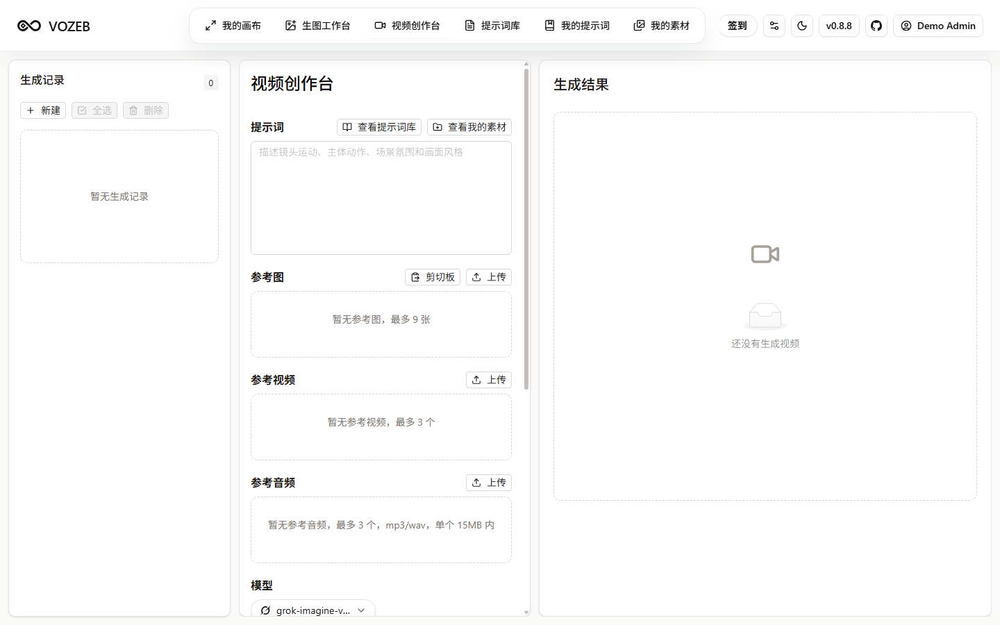</td>
  </tr>
  <tr>
    <td width="50%">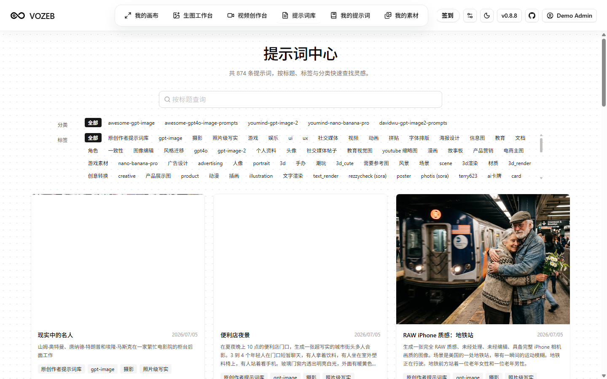</td>
    <td width="50%">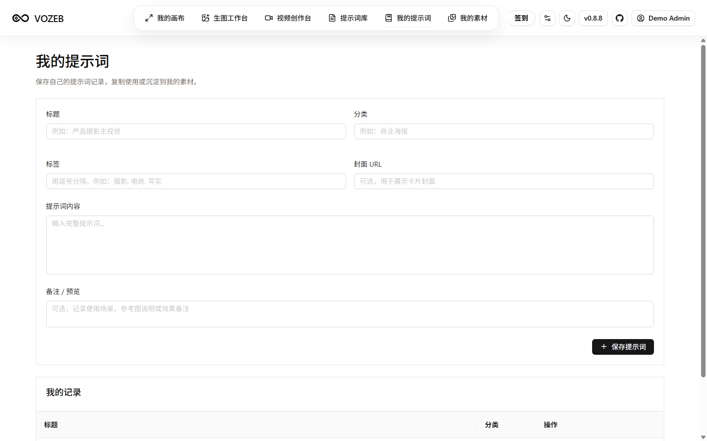</td>
  </tr>
  <tr>
    <td width="50%">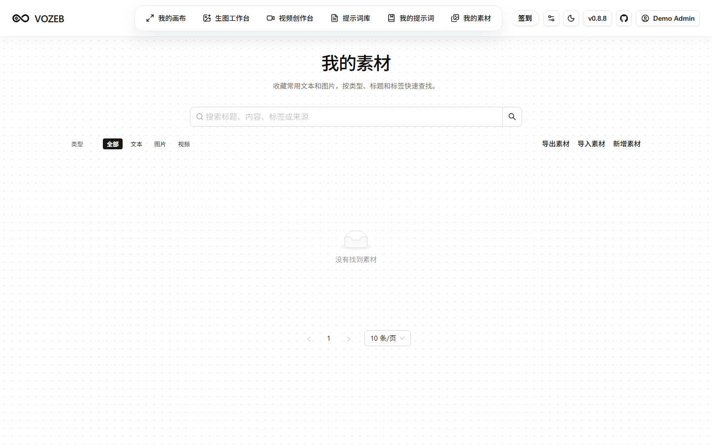</td>
    <td width="50%">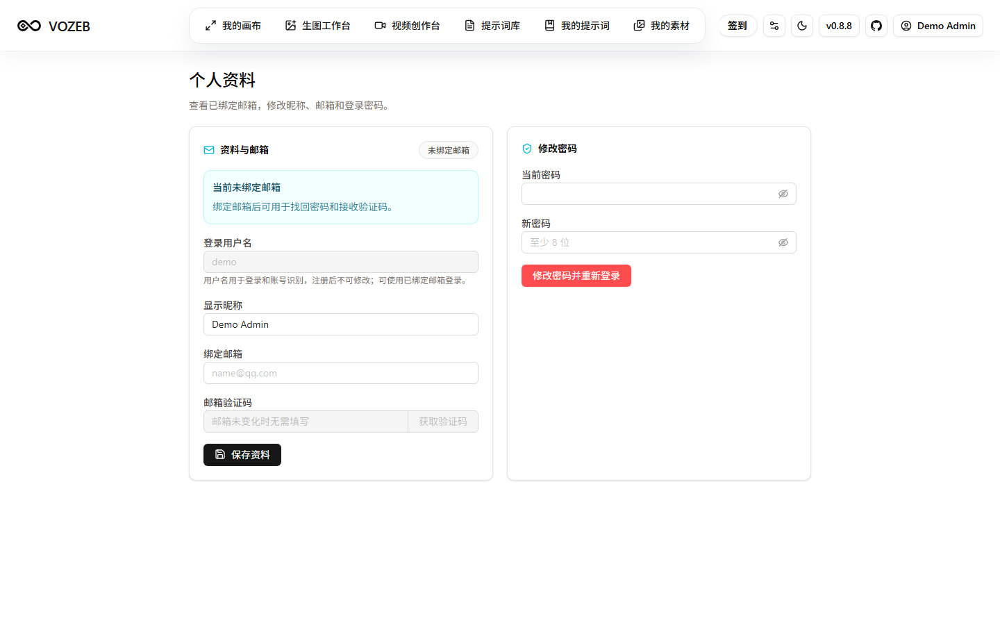</td>
  </tr>
  <tr>
    <td colspan="2">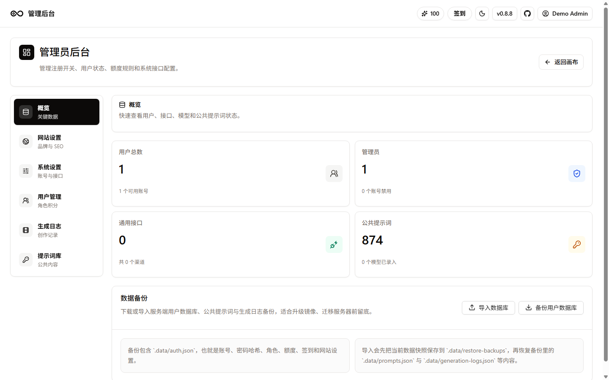</td>
  </tr>
</table>

## 技术栈

- 前端：Next.js、React、TypeScript、Tailwind CSS、Ant Design、Zustand、TanStack Query。
- 存储：浏览器本地存储为主，支持导入导出与可选 WebDAV 同步。
- Agent：Canvas Agent、MCP、Codex / Claude Code 本地集成。
- 部署：Vercel 或 Docker。

## 快速开始

```bash
git clone git@github.com:csyqlz/vozeb.git
cd vozeb/web
pnpm install
pnpm run dev
```

运行后默认端口为 `3000`，可访问 `http://localhost:3000`。

首次打开后进入右上角配置，填入自己的 OpenAI 兼容 `Base URL` 和 `API Key`。

## Docker 运行

低配服务器（包括 0.5G 内存的小机器）建议只使用发布镜像，服务器不执行 `next build`，通常只需要拉镜像和启动容器，才能接近 2 分钟内完成部署：

```yaml
services:
  app:
    image: ghcr.io/csyqlz/vozeb:latest
    container_name: vozeb
    ports:
      - "3000:3000"
    volumes:
      - vozeb-data:/app/web/.data
    environment:
      VOZEB_DATA_DIR: /app/web/.data
      VOZEB_INTERNAL_ORIGIN: http://127.0.0.1:3000
    restart: unless-stopped

volumes:
  vozeb-data:
```

账号、后台设置、签到记录和公共提示词会写入容器内 `/app/web/.data`。使用上面的 Compose 配置升级镜像时，`vozeb-data` 卷会继续保留这些数据；只有手动执行 `docker volume rm` 或 `docker compose down -v` 才会删除。若你之前用的是没有 volume 的旧容器，请先进入旧容器备份 `/app/web/.data` 再替换镜像。本地 standalone 预览会使用 `web/.data`，不会把数据库放进会被重建清理的 `.next/standalone`。

更新到最新镜像：

```bash
docker compose pull
docker compose up -d
```

0.5G 服务器不要现场构建源码。Next.js 生产构建需要安装依赖、编译页面、收集页面数据并输出 standalone，内存太小时很容易被系统杀掉。当前 `docker-compose.yml` 默认使用发布镜像，不会在服务器执行 `next build`。需要自定义源码时，建议在本机或 GitHub Actions 构建并推送镜像，再让服务器执行 `docker compose pull && docker compose up -d`。

如果服务器内存只有 0.5G，可以使用低内存 Compose 文件。它同样只拉取 `ghcr.io/csyqlz/vozeb:latest` 发布镜像，并给运行中的容器加上 512MB 内存限制、`NODE_OPTIONS=--max-old-space-size=384` 和 `UV_THREADPOOL_SIZE=2`：

```bash
docker compose -f docker-compose.lowmem.yml pull
docker compose -f docker-compose.lowmem.yml up -d
```

低内存机器如仍然运行不稳，再考虑增加 swap；但不要在 0.5G 服务器上执行 `docker compose up -d --build`。

如果你的机器至少有 2G 内存，并且必须基于当前源码本地构建，再使用下面的命令：

```bash
docker compose -f docker-compose.local.yml up -d --build
```

## New API 自动配置

如果使用 New API，可在 `系统设置 -> 聊天方式 -> 添加聊天设置` 中填入：

```text
https://your-vozeb-domain.example?apiKey={key}&baseUrl={address}
```

跳转后会自动打开配置弹窗并填入 API Key 和 Base URL。请把示例域名替换成你的 VOZEB 部署地址。

## 文档

- [快速开始](docs/content/docs/overview/quick-start.mdx)
- [功能介绍](docs/content/docs/overview/features.mdx)
- [Render 部署](docs/content/docs/overview/render.mdx)
- [Docker 部署](docs/content/docs/overview/docker.mdx)
- [第三方 GitHub 提示词仓库](docs/content/docs/overview/third-party-prompt-repositories.mdx)
- [画布节点操作手册](docs/content/docs/canvas/canvas-node-manual.mdx)
- [画布快捷键](docs/content/docs/canvas/canvas-shortcuts.mdx)
- [本地开发](docs/content/docs/backend/local-development.mdx)
- [画布数据结构](docs/content/docs/backend/canvas-data-structure.mdx)
- [本地 Canvas Agent](canvas-agent/README.md)
- [Codex app 插件](plugins/vozeb-canvas)
- [开源协议](docs/content/docs/business/license.mdx)
- [贡献者协议](docs/content/docs/business/cla.mdx)
- [漏洞提交](docs/content/docs/support/security.mdx)
- [待办事项](docs/content/docs/progress/todo.mdx)
- [待测试](docs/content/docs/progress/pending-test.mdx)

## 致谢

VOZEB 基于原创开源画布项目继续开发。感谢原创作者 basketikun 对无限画布、AI 创作工作流、Canvas Agent 和 Codex 插件能力的开源贡献。

也感谢 LinuxDO 社区、相关提示词开源仓库、Codex / Claude Code 生态和所有工具链项目提供的灵感与基础设施。

## 开源协议

本项目继续遵循 GNU Affero General Public License v3.0，见 [LICENSE](LICENSE)。二次开发、分发或部署时请遵守 AGPL-3.0 协议，并保留原作者与本项目的开源信息。
